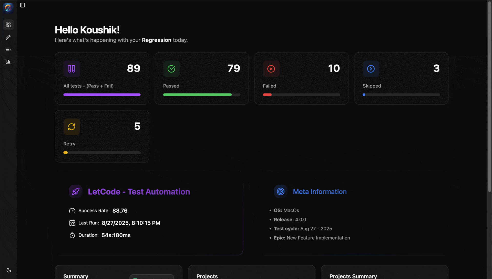

# Ortoni Report

A comprehensive and visually appealing HTML report generator tailored for Playwright tests. Designed with powerful features and customizable options, Ortoni Report simplifies the process of reviewing and managing test results, making test reporting more intuitive and accessible.

### Live Demo: [Ortoni Report](https://ortoni.letcode.in/)



---

## Key Features

### 1. **Organization & Navigation**

- **Sidebar Navigation**: Offering a more structured and intuitive navigation experience.
- **Sidebar Sections**:
  - **Dashboard**: View overall test statistics and summaries.
  - **Tests**: Browse detailed test results, including logs, screenshots, and errors.
- **Hierarchical Grouping**: Tests are structured by filename, suite, and project, providing an organized overview.
- **Test History & Detailed Breakdown**: Support for displaying up to 10 recent executions, categorized by suite and project for easy navigation.
- **Integration and Configuration**: Easy integration with Playwright using TypeScript/JavaScript, with configurable preferences.
- **Advanced Filtering**: Filters for project, tags, and status, with the ability to reset for a full view.

### 2. **Detailed Reporting**

- **Comprehensive Test Details**: Status, duration, tags, errors, logs, screenshots, videos, and trace data.
- **Test Attachments**: Screenshots, videos, trace viewer, steps, error stack trace, and console logs.
- **Selected Status Display**: The UI highlights the active status filter for clarity.

### 3. **Visualization & Insights**

- **Summary Statistics**: Total tests and distribution of passed, failed, skipped, and flaky tests with success rates.
- **Chart Visualizations**: Plotarea chart for overall status, doghnut for projects and bar charts for project-specific comparisons.
- **All-New Colorful UI**: A vibrant, redesigned interface with better contrast and readability.

### 4. **Customization & Personalization**

- **New Color Scheme**: Supports both **light and dark themes**, ensuring a comfortable viewing experience.
- **Add Your Logo**: Configurable logo for brand personalization.
- **Flexibility with Attachments**: Choose Base64 or file paths for screenshots.
- **Custom Report Paths**: Set custom filenames and folder paths for reports.

### 5. **User Experience & Usability**

- **Advanced Search and Reset**: Search tests with keywords or criteria, with reset options.
- **Hide Skipped Tests by Default**: Simplifies view by hiding skipped tests initially.
- **Share Reports**: Self-contained reports for easy sharing and review.
- **Comprehensive Filters**: Apply multiple filters simultaneously for focused insights.
- **Meta**: Add user meta information to the reporter

---

## Installation & Setup

### Step 1: Install Ortoni Report

Run the following command to install the **ortoni-report** package globally:

```bash
npm install -D ortoni-report
```

### Step 2: Configure in `playwright.config.ts`

Set up **Ortoni Report** in your Playwright configuration file with the following example:

```typescript
import { defineConfig } from "@playwright/test";
import { OrtoniReportConfig } from "ortoni-report";

const reportConfig: OrtoniReportConfig = {
  open: process.env.CI ? "never" : "always", // default to never
  folderPath: "report-db",
  filename: "index.html",
  logo:"logo.{png, jpg}",
  title: "Ortoni Test Report",
  showProject: !true,
  projectName: "Ortoni-Report",
  testType: "e2e",
  authorName: "Koushik",
  base64Image: false,
  stdIO: false,
  preferredTheme: "light",
  meta: {
    project: "Playwright",
    version: "3.0.0",
    description: "Playwright test report",
    testCycle: "1",
    release: "1.0.0",
    platform: "Windows",
  },
};

export default defineConfig({
  reporter: [["ortoni-report", reportConfig]],
  // Other Playwright configurations
});
```

### Configure in `playwright.config.js`

```javascript
import { defineConfig } from "@playwright/test";

const reportConfig = {
  open: process.env.CI ? "never" : "always",
  folderPath: "report-db",
  filename: "index.html",
  logo:"logo.{png, jpg}",
  title: "Ortoni Test Report",
  showProject: !true,
  projectName: "Ortoni-Report",
  testType: "e2e",
  authorName: "Koushik",
  base64Image: false,
  stdIO: false,
  preferredTheme: "light",
  meta: {
    project: "Playwright",
    version: "3.0.0",
    description: "Playwright test report",
    testCycle: "1",
    release: "1.0.0",
    platform: "Windows",
  },
};

export default defineConfig({
  reporter: [["ortoni-report", reportConfig]],
  // Other Playwright configurations
});
```

## Using the Ortoni Report CLI

### Command: `show-report`

This command starts a local Express server and serves the generated Ortoni report. You can open the report in your default browser.

#### Options

- **`-d, --dir <path>`**: Path to the folder containing the report. Defaults to `ortoni-report`.
- **`-f, --file <filename>`**: Name of the report file. Defaults to `ortoni-report.html`.
- **`-p, --port <port>`**: Port number for the local server. Defaults to `2004`.

#### Example Usage

1. **Default Usage**

   ```bash
   npx ortoni-report show-report
   ```

   This will:
   - Look for the report file `ortoni-report.html` in the `ortoni-report` folder.
   - Start the server on port `2004`.

2. **Custom folder and file Options**
   ```bash
   npx ortoni-report show-report --dir custom-folder --file my-report.html --port 3000
   ```
   This will:
   - Look for the file `my-report.html` in `custom-folder`.
   - Start the server on port `3000`.

#### Errors and Troubleshooting

- If the specified file or folder does not exist, you will see an error like:
  ```
  Error: The file "my-report.html" does not exist in the folder "custom-folder".
  ```
  Ensure the file and folder paths are correct.

#### Accessing the Report

Once the server is running, open your browser and navigate to:

```
http://localhost:<port>
```

Replace `<port>` with the port number you specified or the default port (`2004`). The report will automatically open in your default browser if the `always` option is enabled.

---

## Changelog

Stay up-to-date with the latest features, improvements, and bug fixes by reviewing the [Changelog](https://github.com/ortoniKC/ortoni-report/blob/main/changelog.md).

## License

This project is licensed under the terms of the [LICENSE](https://github.com/ortoniKC/ortoni-report/blob/main/LICENSE.md).

## Feedback and Contributions

I encourage you to share feedback and contribute to improving Ortoni Report! For issues, suggestions, or contributions, please visit our [GitHub repository](https://github.com/ortoniKC/ortoni-report).

## Support

If you'd like to support this project, you can donate via UPI:


[Buy me coffee](https://buymeacoffee.com/letcode) | [Paypal](https://paypal.me/koushik1677?country.x=IN&locale.x=en_GB)

Thank you for using **Ortoni Report**! I'm committed to providing you with a superior Playwright testing experience.

---
**Developer & Designer**
[Koushik Chatterjee](https://letcode.in/contact)

**LetCode with Koushik**