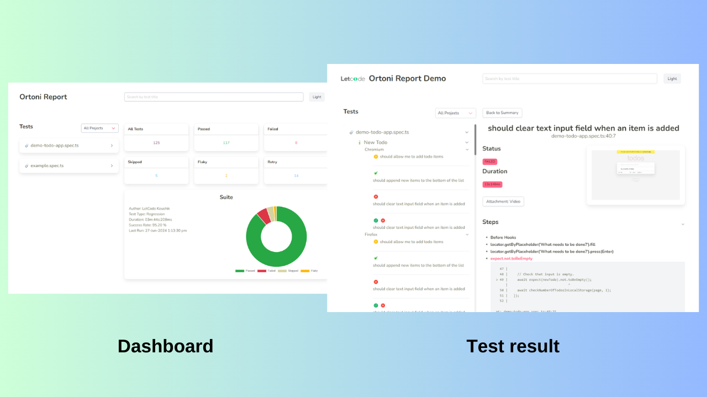

# Playwright Report by Koushik

Welcome to Ortoni Report (Playwright report - unofficial), a robust HTML report generator tailored for Playwright tests. Ortoni Report introduces powerful features to enhance test reporting, making it easier to visualize and manage test results.

Explore the live demo: [OrtoniReport Demo](https://ortoni.netlify.app/)



## Key Features

1. **Hierarchical Grouping**
   - Tests are grouped hierarchically by file name, suite, and project, offering a structured view of test execution.

2. **Detailed Breakdown**
   - Each suite includes categorized tests under respective projects, providing clear organization.

3. **Comprehensive Test Details**
   - Display test status (passed, failed, skipped), duration, errors, logs, and screenshots.
   - Sort and filter tests by suite, project, and script for detailed insights.

4. **Summary Statistics**
   - Overview of total tests, passed, failed, skipped, and flaky tests.
   - Success rate calculation for test suites.

5. **Chart Visualization**
   - Doughnut chart representation for visualizing test result distribution (passed, failed, skipped, flaky).

6. **Search and Reset**
   - Search functionality to filter tests based on user input.
   - Reset option to clear filters and display all tests.

7. **Customization and Themes**
   - Customize project details, author name, test types, and toggle between dark/light themes.
   - Option to choose between Base64 images or file path for screenshots.
   - User can set the report file name

8. **Responsive Design**
   - Optimized layout that adapts seamlessly to different screen sizes for accessibility.

9. **Integration and Configuration**
   - Easily integrate with Playwright configurations using TypeScript/JavaScript.
   - Configure reporting preferences within your Playwright setup.
   
10. **Add logo to the report**
      - Add relative or absolute path of the image to the config.

11. **Share report**
      - Generat the report and zip the folder and share.   


### How to Use ortoni-report

### Installation

1. **Install the ortoni-report package**:

    ```sh
    npm install -g ortoni-report
    ```

### Generate and Bundle HTML Report

2. **Generate and bundle the report** (Optional):

    ```sh
    npx ortoni-report gr -f ortoni-report.html
    ```

### Command Overview

- `npx ortoni-report gr -f <filename>`: Bundle the specified report file.
  - `-f, --filename <filename>`: Specify the filename for the generated report (default: `ortoni-report.html`).   

### Configurable Report Generation

Configure OrtoniReport in your `playwright.config.ts`:

```typescript
import { defineConfig } from '@playwright/test';
import { OrtoniReportConfig } from 'ortoni-report';

const reportConfig: OrtoniReportConfig = {
  filename:"myawesomereport.html",
  logo: "path/logo.png",
  authorName: "LetCode Koushik",
  base64Image: false,
  preferredTheme: "dark",
  projectName: "Ortoni Demo Report",
  testType: "Smoke"
}

export default defineConfig({
    reporter: [['ortoni-report', reportConfig], ['dot']],
    // Other Playwright configurations
});
```

### Common Issue
```
Error: Command failed:
@parcel/namer-default: Target "main" declares an     
output file path of "index.js" which does not match  
the compiled bundle type "html".
```
Solution:
Remove "main" in the ```package.json``` file

### Comprehensive Test Details

- **Rich Test Information:** Each test includes details like title, status, duration, tags, errors, steps, logs, video, and screenshot.
- **Color-coded Status:** Status indicators (green for passed, red for failed, yellow for skipped) for quick identification.

### Handlebars Template Integration

- **Customizable Reports:** HTML reports are generated using Handlebars templates, offering flexibility in customization and styling.
- **JSON Helper:** Includes a custom Handlebars helper for managing complex data structures.

### Future Plans

- **Enhanced Customization:** Additional options for customizing report appearance and structure.
- **CI/CD Integration:** Improved support for CI/CD environments.
- **Advanced Filtering:** Expanded filtering capabilities to focus on specific test subsets.

### Change Logs

Explore the latest updates and changes in our [Changelog](https://github.com/ortoniKC/ortoni-report/blob/main/changelog.md).

### License

View the [LICENSE](https://github.com/ortoniKC/ortoni-report/blob/main/LICENSE.md) for licensing details.

### Feedback and Contributions

We value your feedback and contributions! For issues, suggestions, or contributions, visit our [GitHub repository](https://github.com/ortoniKC/ortoni-report).

Thank you for choosing OrtoniReport. We're committed to enhancing your Playwright testing experience.

---

**LetCode with Koushik**

---